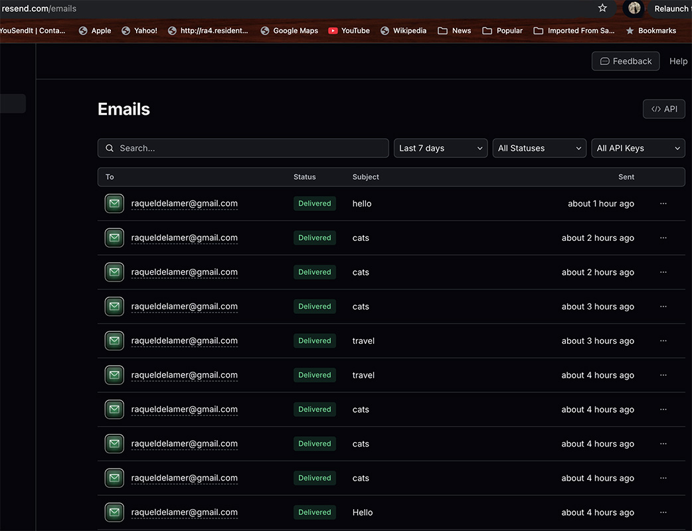

## ## Roadmap : Email Integration , Key-Value Store on Server, Combine Features

- [x] Create an endpoint in your /api folder called email.js
- [x] The endpoint should return a JSON object with a message that says "Email sent!" or "Error sending email!"
- [x] Create an account on resend.com
- [x] Send an email to yourself using the API endpoint you just created
- [x] Explains the server architecture and includes the diagram in README.md
- [x] - Use Upstash to add data persistence to your server
- [x] - Create an endpoint in your /api folder that increments a counter each time it is hit
- [x] - Deploy on Vercel
 

### Deployment on Vercel 

<a href="https://capstoneproject-3.vercel.app/contact" target="_blank"> https://capstoneproject-3.vercel.app/contact Link </a>

### Assignment 1: Email Integration & Upstash Key-Value Store on Server Deployment on Vercel 

  
- [x] This assignment is about creating a strong server application. It uses Vercel and Upstash to safely store user data, and the Resend API for sending emails. By working on this project, you'll get practical experience in building servers, storing data, and integrating email features.
 
 

### Assignment 2: Next.js Client Project Assignment 

<a href="https://capstoneproject-3.vercel.app/contact" target="_blank"> https://capstoneproject-3.vercel.app/contact Link </a>

  

[API routes](https://nextjs.org/docs/pages/building-your-application/routing/api-routes) can be accessed on [http://localhost:3000/api/hello](http://localhost:3000/api/hello). This endpoint can be edited in `pages/api/hello.js`.

The `pages/api` directory is mapped to `/api/*`. Files in this directory are treated as [API routes](https://nextjs.org/docs/pages/building-your-application/routing/api-routes) instead of React pages.

This project uses [`next/font`](https://nextjs.org/docs/pages/building-your-application/optimizing/fonts) to automatically optimize and load [Geist](https://vercel.com/font), a new font family for Vercel.

